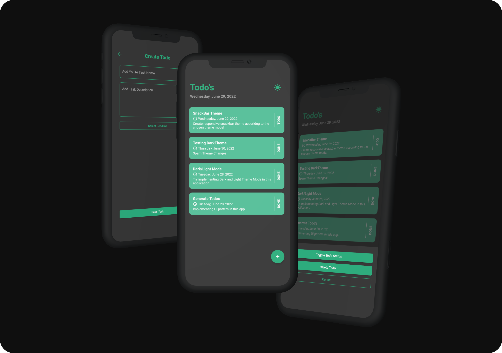

# 📱 Todo App 📱

## 🚀 Track Your'e Daily Activity 🚀
A simple application that accommodates a user's daily Todo list. This application can store user Todo's on the device locally by using the Sqflite package and Path package to specify the database storage location in the device directory. In addition, implementing the bloc pattern as state management takes care of the business logic in the application. With bloc business logic, this app also supports light and dark modes. The Todo's card design was inspired by a Flutter Developer named dbestech.

## 🔍 Application Preview 🔍

## 📄 Related Reference 📄
- The sqflite complate documentation can be found [here](https://pub.dev/packages/sqflite).
- Check out dbstech Todo App [here](https://www.youtube.com/watch?v=2L8maZUY2hU&t=1s).
